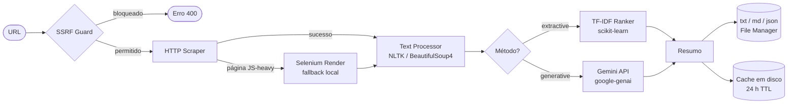
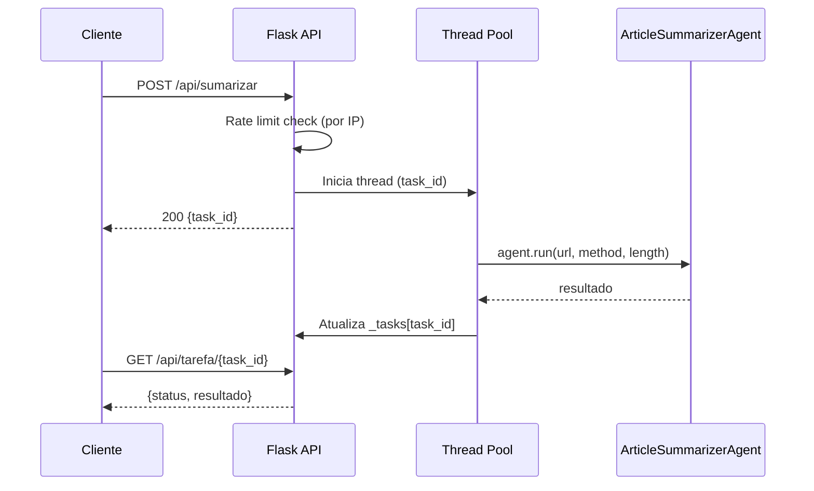

# Article Summarizer Agent

**Agente Python que extrai e resume artigos da web — TF-IDF offline ou Google Gemini, com API REST e interface no navegador.**

[](https://github.com/Lucasantunesribeiro/article_summarizer_agent/actions/workflows/ci.yml)


---

## Sumário

1. [Arquitetura e Stack Tecnológica](#arquitetura-e-stack-tecnológica)
2. [Pré-requisitos e Instalação Local](#pré-requisitos-e-instalação-local)
3. [Organização do Repositório](#organização-do-repositório)
4. [Scripts de Teste e Build](#scripts-de-teste-e-build)
5. [Variáveis de Ambiente](#variáveis-de-ambiente)
6. [Referência da API](#referência-da-api)
7. [Modelos Gemini](#modelos-gemini)
8. [Deploy](#deploy)
9. [Segurança](#segurança)
10. [Contribuindo](#contribuindo)

---

## Arquitetura e Stack Tecnológica

### Fluxo de dados



**Camada Flask — tarefas assíncronas via threads**



### Stack

| Componente | Pacote | Versão mínima |
|---|---|---|
| Linguagem | Python | 3.10 |
| Framework web | Flask | 3.0.0 |
| Servidor WSGI | Gunicorn | 21.2.0 |
| CORS | flask-cors | 4.0.0 |
| IA generativa | google-genai | 1.0.0 |
| Extração HTML | beautifulsoup4 | 4.12.0 |
| HTTP | requests | 2.31.0 |
| Encoding detection | chardet | 5.1.0 |
| NLP / tokenização | nltk | 3.8.1 |
| TF-IDF ranking | scikit-learn | 1.3.0 |
| Detecção de idioma | langdetect | 1.0.9 |
| Barra de progresso (CLI) | tqdm | 4.65.0 |
| Cores no terminal (CLI) | colorama | 0.4.6 |

> Selenium (`selenium>=4.20.0`) e `webdriver-manager>=4.0.1` são dependências **opcionais**, necessárias apenas localmente para renderização de páginas com JavaScript. Não são instaladas no Render/Cloud Run.

---

## Pré-requisitos e Instalação Local

**Requisitos do sistema:**

- Python 3.10 ou superior
- pip
- Git
- (Opcional) Docker para execução conteinerizada

### Passo a passo

```bash
# 1. Clonar o repositório
git clone https://github.com/Lucasantunesribeiro/article_summarizer_agent.git
cd article_summarizer_agent
```

```bash
# 2. Criar o ambiente virtual

# Linux / macOS
python -m venv .venv
source .venv/bin/activate

# Windows (WSL)
python -m venv .venv
source .venv/bin/activate

# Windows (Prompt / PowerShell nativo)
python -m venv .venv
.venv\Scripts\activate
```

```bash
# 3. Instalar dependências
pip install -r requirements.txt

# Instalar também as ferramentas de desenvolvimento
pip install ruff pytest pytest-cov
```

```bash
# 4. Baixar os dados do NLTK necessários em runtime
python -c "
import nltk
for pkg in ('punkt', 'punkt_tab', 'stopwords', 'wordnet'):
    nltk.download(pkg, quiet=True)
"
```

```bash
# 5. Configurar variáveis de ambiente
cp .env.example .env
# Edite o arquivo .env com suas chaves — veja a seção Variáveis de Ambiente
```

```bash
# 6. Executar a aplicação web

# Modo desenvolvimento (Flask dev server)
python app.py
# ou
make run

# Modo produção local (Gunicorn)
gunicorn --bind 0.0.0.0:5000 --workers 2 --threads 4 --timeout 120 app:app
# ou
make run-prod
```

Acesse `http://localhost:5000` no navegador.

**Saída esperada ao iniciar com sucesso:**

```
2026-02-26 10:00:00,000 - __main__ - INFO - Initialising ArticleSummarizerAgent…
2026-02-26 10:00:00,100 - __main__ - INFO - Agent ready.
2026-02-26 10:00:00,101 - __main__ - INFO - Starting on 0.0.0.0:5000 (debug=False)
```

### Uso via CLI (headless)

O agente pode ser executado diretamente pelo terminal, sem a interface web:

```bash
# Resumo básico com método padrão (extractive)
python main.py --url "https://example.com/article"

# Especificar método e tamanho do resumo
python main.py --url "https://example.com/article" --method generative --length short
python main.py --url "https://example.com/article" --method extractive --length long

# Modo interativo (solicita URL no terminal)
python main.py --interactive

# Verificar status do agente e configuração ativa
python main.py --status

# Limpar o cache em disco
python main.py --clear-cache
```

**Parâmetros do CLI:**

| Parâmetro | Valores aceitos | Padrão |
|---|---|---|
| `--url` | URL válida (http/https) | — |
| `--method` | `extractive`, `generative` | `extractive` |
| `--length` | `short`, `medium`, `long` | `medium` |
| `--interactive` | flag (sem valor) | — |
| `--status` | flag (sem valor) | — |
| `--clear-cache` | flag (sem valor) | — |

---

## Organização do Repositório

```
article_summarizer_agent/
├── app.py                   # API Flask — rotas HTTP e gestão de tasks assíncronas
├── main.py                  # CLI e orquestrador do pipeline (5 passos)
├── config.py                # Singleton de configuração — todas as settings via env vars
├── modules/
│   ├── __init__.py
│   ├── web_scraper.py       # Extração HTTP com proteção SSRF
│   ├── text_processor.py    # Limpeza e tokenização de texto (NLTK)
│   ├── summarizer.py        # Dispatcher: encaminha para Gemini ou TF-IDF
│   ├── gemini_summarizer.py # Integração Google Gemini API (google-genai)
│   ├── file_manager.py      # Salva resultados (txt/md/json) e cache em disco
│   └── selenium_scraper.py  # Fallback JS rendering (opcional, apenas local)
├── tests/
│   ├── test_api.py          # Testes de rotas Flask (74 testes no total)
│   ├── test_app_utils.py
│   ├── test_config.py
│   ├── test_ssrf.py
│   ├── test_summarizer.py
│   └── test_text_processor.py
├── templates/               # Templates Jinja2 (index, history, about, settings, error)
├── static/
│   └── css/
│       └── custom.css       # Estilos customizados da interface
├── docs/                    # Guias de hospedagem (Render, Cloud Run)
├── .github/
│   └── workflows/
│       └── ci.yml           # Pipeline CI: lint (ruff) + testes (pytest) + docker build
├── Dockerfile               # Imagem Python 3.12-slim, Gunicorn na porta 8080
├── render.yaml              # Configuração de deploy no Render
├── render-build.sh          # Script de build para o Render
├── Procfile                 # Comando de start para Heroku/Render
├── pyproject.toml           # Configuração de ruff, pytest e coverage (versão 2.0.0)
└── requirements.txt         # Dependências com versões mínimas fixadas
```

---

## Scripts de Teste e Build

### Usando Make (recomendado)

```bash
# Ver todos os targets disponíveis
make help

# Criar virtualenv e instalar tudo (incluindo ferramentas de dev)
make setup

# Instalar/sincronizar dependências (virtualenv já criado)
make install

# Executar a suíte de testes
make test

# Testes com relatório de cobertura
make test-cov

# Lint (verificar)
make lint

# Formatar o código
make format

# Lint com correção automática de problemas seguros
make lint-fix

# Executar a aplicação web em modo desenvolvimento
make run

# Executar com Gunicorn (simula produção localmente)
make run-prod

# Executar via CLI (passar URL como variável)
make run-cli URL="https://example.com/article"

# Build da imagem Docker
make docker-build

# Executar o container Docker (requer .env)
make docker-run

# Limpar artefatos de build e cache
make clean
```

### Comandos diretos (sem Make)

```bash
# Executar todos os testes com saída detalhada
pytest tests/ -v

# Testes com cobertura de código
pytest tests/ --cov=modules --cov-report=term-missing

# Cobertura com threshold mínimo (falha abaixo de 60%)
pytest tests/ --cov=modules --cov-report=term-missing --cov-fail-under=60

# Lint — verificar problemas de estilo e qualidade
ruff check .

# Verificar formatação (não altera arquivos)
ruff format --check .

# Aplicar formatação
ruff format .
```

### Docker

```bash
# Build da imagem
docker build -t article-summarizer .

# Executar o container expondo a porta 5000
docker run -p 5000:8080 -e GEMINI_API_KEY=sua_chave_aqui -e SECRET_KEY=sua_chave_secreta article-summarizer

# Executar com arquivo .env
docker run -p 5000:8080 --env-file .env article-summarizer

# Docker Compose (se disponível)
make docker-compose-up
```

> O Dockerfile expõe a porta `8080` (padrão do Cloud Run). O mapeamento `-p 5000:8080` no `docker run` redireciona para `localhost:5000`.

### Pipeline CI (GitHub Actions)

O arquivo `.github/workflows/ci.yml` executa três jobs em paralelo a cada push ou pull request para `main`:

| Job | O que faz |
|---|---|
| `lint` | `ruff check .` e `ruff format --check .` no Python 3.12 |
| `test` | `pytest tests/ -v --cov=modules` no Python 3.12 com NLTK data baixado |
| `docker-build` | `docker build -t article-summarizer:ci .` para validar o Dockerfile |

---

## Variáveis de Ambiente

Copie `.env.example` para `.env` e ajuste conforme o ambiente:

```bash
cp .env.example .env
```

### Referência completa

| Variável | Obrigatório | Padrão | Descrição |
|---|---|---|---|
| `SECRET_KEY` | Sim (produção) | gerado automaticamente em dev | Chave secreta do Flask para sessões. Use uma string longa e aleatória em produção. |
| `GEMINI_API_KEY` | Sim (generative) | — | Chave da [Google AI Studio](https://aistudio.google.com/apikey). Necessária apenas com `SUMMARIZATION_METHOD=generative`. |
| `GEMINI_MODEL_ID` | Não | `gemini-2.5-flash-preview-05-20` | ID do modelo Gemini. Veja a seção [Modelos Gemini](#modelos-gemini). |
| `GEMINI_TIMEOUT` | Não | `30` | Timeout em segundos para chamadas à API do Gemini. |
| `SUMMARIZATION_METHOD` | Não | `extractive` | Método padrão de resumo: `extractive` (TF-IDF offline) ou `generative` (Gemini). |
| `SUMMARY_LENGTH` | Não | `medium` | Tamanho padrão do resumo: `short`, `medium` ou `long`. |
| `RATE_LIMIT_MAX` | Não | `10` | Número máximo de requisições por IP dentro da janela de tempo. |
| `RATE_LIMIT_WINDOW` | Não | `60` | Duração da janela de rate limit em segundos. |
| `ADMIN_TOKEN` | Sim (produção) | — | Token de autenticação para o endpoint `POST /api/limpar-cache`. Enviado no header `X-Admin-Token`. |
| `OUTPUT_DIR` | Não | `outputs` | Diretório onde os arquivos de resumo são gravados. |
| `CACHE_ENABLED` | Não | `true` | Habilita ou desabilita o cache em disco. Valores: `true` ou `false`. |
| `CACHE_TTL` | Não | `86400` | Tempo de vida do cache em segundos (padrão: 24 horas). |
| `TIMEOUT_SCRAPING` | Não | `30` | Timeout de requisições HTTP do scraper em segundos. |
| `MAX_RETRIES_SCRAPING` | Não | `3` | Número máximo de tentativas em caso de falha no scraping. |
| `LOG_LEVEL` | Não | `INFO` | Nível de log: `DEBUG`, `INFO`, `WARNING`, `ERROR` ou `CRITICAL`. |
| `CORS_ORIGINS` | Não | `*` | Origens CORS permitidas para `/api/*`. Separe múltiplas origens por vírgula. |
| `FLASK_DEBUG` | Não | `false` | Habilita o modo debug do Flask. **Nunca defina como `true` em produção.** |
| `PORT` | Não | `5000` | Porta onde o servidor Flask/Gunicorn escuta. Definida automaticamente pelo Render e Cloud Run. |

### Template `.env`

```dotenv
# ── Segurança ─────────────────────────────────────────────────────────────────
SECRET_KEY=sua_chave_secreta_longa_e_aleatoria_aqui
ADMIN_TOKEN=seu_token_admin_aqui

# ── Google Gemini ─────────────────────────────────────────────────────────────
GEMINI_API_KEY=sua_chave_gemini_aqui
GEMINI_MODEL_ID=gemini-2.5-flash-preview-05-20
GEMINI_TIMEOUT=30

# ── Sumarização ───────────────────────────────────────────────────────────────
SUMMARIZATION_METHOD=extractive
SUMMARY_LENGTH=medium

# ── Rate Limiting ─────────────────────────────────────────────────────────────
RATE_LIMIT_MAX=10
RATE_LIMIT_WINDOW=60

# ── Saída e Cache ─────────────────────────────────────────────────────────────
OUTPUT_DIR=outputs
CACHE_ENABLED=true
CACHE_TTL=86400

# ── Scraping ──────────────────────────────────────────────────────────────────
TIMEOUT_SCRAPING=30
MAX_RETRIES_SCRAPING=3

# ── Observabilidade ───────────────────────────────────────────────────────────
LOG_LEVEL=INFO

# ── CORS ──────────────────────────────────────────────────────────────────────
CORS_ORIGINS=*

# ── Flask ─────────────────────────────────────────────────────────────────────
# FLASK_DEBUG=false  # Nunca defina como true em produção
```

> ⚠️ Nunca versione o arquivo `.env` com valores reais. O `.gitignore` já exclui esse arquivo do repositório.

> 💡 No Render, configure as variáveis no painel **Environment** do serviço. `CHROME_BIN` não é necessário — Selenium não é suportado no free tier e o agente realiza fallback automático para HTTP simples.

---

## Referência da API

Todos os endpoints retornam JSON. Os endpoints assíncronos usam `task_id` para polling.

| Método | Endpoint | Descrição |
|---|---|---|
| `POST` | `/api/sumarizar` | Envia uma URL para sumarização. Retorna `{task_id}` imediatamente. |
| `GET` | `/api/tarefa/<task_id>` | Consulta o status e o resultado da tarefa quando `status == "done"`. |
| `GET` | `/api/download/<task_id>/<fmt>` | Download do arquivo de saída. `fmt` aceita `txt`, `md` ou `json`. |
| `GET` | `/health` | Verificação de saúde. Retorna status do agente, modelo Gemini ativo e método de sumarização. |
| `GET` | `/api/status` | Status detalhado do agente. |
| `GET` | `/api/estatisticas` | Contadores da sessão (total, concluídas, falhas, em execução). |
| `POST` | `/api/limpar-cache` | Limpa o cache em disco. Requer header `X-Admin-Token`. |

### Exemplos de uso

**Enviar URL e acompanhar o resultado:**

```bash
# 1. Submeter URL para sumarização
curl -s -X POST http://localhost:5000/api/sumarizar \
  -H "Content-Type: application/json" \
  -d '{"url": "https://example.com/article", "method": "generative", "length": "medium"}' \
  | python -m json.tool

# Saída esperada:
# {
#   "success": true,
#   "task_id": "550e8400-e29b-41d4-a716-446655440000",
#   "message": "Summarisation started."
# }
```

```bash
# 2. Consultar o status da tarefa
curl -s http://localhost:5000/api/tarefa/550e8400-e29b-41d4-a716-446655440000 \
  | python -m json.tool

# Saída quando concluído:
# {
#   "success": true,
#   "task": {
#     "status": "done",
#     "progress": 100,
#     "result": {
#       "summary": "...",
#       "method_used": "generative",
#       "execution_time": 3.2
#     }
#   }
# }
```

```bash
# 3. Download do resumo em Markdown
curl -OJ http://localhost:5000/api/download/550e8400-e29b-41d4-a716-446655440000/md
```

```bash
# 4. Limpar o cache (requer ADMIN_TOKEN configurado)
curl -s -X POST http://localhost:5000/api/limpar-cache \
  -H "X-Admin-Token: seu_token_admin_aqui" \
  | python -m json.tool
```

```bash
# 5. Verificação de saúde
curl -s http://localhost:5000/health | python -m json.tool

# Saída esperada:
# {
#   "status": "ok",
#   "agent_ready": true,
#   "gemini_model": "gemini-2.5-flash-preview-05-20",
#   "summarization_method": "extractive"
# }
```

**Corpo da requisição `POST /api/sumarizar`:**

```json
{
  "url": "https://example.com/article",
  "method": "extractive",
  "length": "medium"
}
```

| Campo | Tipo | Obrigatório | Valores |
|---|---|---|---|
| `url` | string | Sim | URL válida (http ou https) |
| `method` | string | Não | `extractive` (padrão) ou `generative` |
| `length` | string | Não | `short`, `medium` (padrão) ou `long` |

---

## Modelos Gemini

O parâmetro `GEMINI_MODEL_ID` seleciona o modelo usado nas sumarizações generativas:

| Model ID | Características |
|---|---|
| `gemini-2.5-flash-preview-05-20` | Padrão. Rápido, baixa latência, custo-efetivo. |
| `gemini-2.5-pro-preview-05-06` | Maior qualidade, contexto longo, custo mais elevado. |
| `gemini-1.5-flash` | Release estável GA, bom equilíbrio entre velocidade e qualidade. |

Consulte a lista completa em [ai.google.dev/gemini-api/docs/models](https://ai.google.dev/gemini-api/docs/models).

Se `GEMINI_API_KEY` não estiver definida ou se a chamada ao Gemini falhar, o agente realiza fallback automático para TF-IDF extractivo (comportamento controlado por `use_fallback` em `config.py`).

---

## Deploy

### Render (free tier)

O arquivo `render.yaml` está pré-configurado. Para fazer o deploy:

1. Faça push do repositório para o GitHub.
2. Acesse [render.com](https://render.com) e crie um novo **Web Service** apontando para o repositório.
3. O Render detecta automaticamente o `render.yaml` e usa:
   - Build command: `./render-build.sh` (executa `pip install -r requirements.txt`)
   - Start command: `gunicorn --bind 0.0.0.0:$PORT --workers 1 --threads 4 --timeout 120 app:app`
   - Python: `3.13.0`
4. Configure as variáveis de ambiente no painel **Environment** do serviço.

> ⚠️ No free tier do Render, Selenium não está disponível (Chrome ausente). O agente realiza fallback automático para extração HTTP simples.

**Variáveis mínimas para o Render:**

```
SECRET_KEY      = <string longa e aleatória>
ADMIN_TOKEN     = <string aleatória>
GEMINI_API_KEY  = <sua chave — somente se usar method=generative>
```

### Google Cloud Run

```bash
# Deploy direto a partir do código-fonte (requer gcloud CLI autenticado)
gcloud run deploy article-summarizer \
  --source . \
  --region us-central1 \
  --allow-unauthenticated \
  --set-env-vars "GEMINI_API_KEY=sua_chave,SECRET_KEY=sua_chave_secreta,SUMMARIZATION_METHOD=generative"
```

O `Dockerfile` incluído usa `python:3.12-slim`, executa Gunicorn com `--bind 0.0.0.0:8080` e cria um usuário não-root `appuser` para segurança em produção.

### Docker (qualquer provedor)

```bash
# Build
docker build -t article-summarizer .

# Executar
docker run -p 5000:8080 \
  -e SECRET_KEY=sua_chave_secreta \
  -e GEMINI_API_KEY=sua_chave_gemini \
  -e SUMMARIZATION_METHOD=generative \
  article-summarizer
```

---

## Segurança

Este projeto é desenvolvido para **extração legítima de conteúdo público**.

- **Proteção SSRF** — todas as URLs são resolvidas e verificadas contra CIDRs bloqueados (loopback `127/8`, RFC-1918 privados `10/8`, `172.16/12`, `192.168/16`, link-local `169.254/16`, CGNAT `100.64/10` e equivalentes IPv6) antes de qualquer requisição de rede.
- **Sem técnicas de bypass** — o código não contém automação furtiva de navegador, falsificação de fingerprint ou resolvedores de CAPTCHA.
- **Verificação SSL sempre ativa** — certificados TLS são verificados em todas as requisições; não há configuração para desativar essa verificação.
- **Limite de 10 MB** — respostas HTTP são truncadas a 10 MB para evitar esgotamento de memória.
- **Rate limiting por IP** — limitador de janela fixa embutido no Flask, sem dependência externa.
- **Cabeçalhos de segurança** — todas as respostas incluem `X-Content-Type-Options`, `X-Frame-Options`, `Referrer-Policy` e `Content-Security-Policy`.
- **ADMIN_TOKEN fail-closed** — o endpoint `/api/limpar-cache` nega acesso quando `ADMIN_TOKEN` não está definido.

Relate problemas de segurança conforme o processo descrito em [SECURITY.md](SECURITY.md).

---

## Contribuindo

1. Faça um fork do repositório e crie uma branch de feature a partir de `main`.
2. Execute `make test` e garanta que todos os 74 testes passam antes de abrir um pull request.
3. Execute `make lint` — o CI bloqueia merges com falhas de lint.
4. Documente variáveis de ambiente novas em `.env.example` e neste README.
5. Para problemas de segurança, siga o processo de divulgação em [SECURITY.md](SECURITY.md).

---

## Licença

[MIT](LICENSE) — livre para usar, modificar e distribuir com atribuição.
