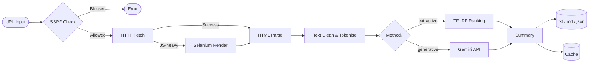

# Article Summarizer Agent

**A Python web application that extracts and summarises any web article — offline TF-IDF or Google Gemini, with a REST API and browser UI.**


> **Demo:** [screenshot placeholder — add to assets/]

---

## Features

- **Dual summarisation modes** — extractive TF-IDF (fully offline, no API key) or Google Gemini (generative, high quality)
- **Robust content extraction** — BeautifulSoup4 for standard pages, Selenium fallback for JavaScript-heavy sites
- **SSRF protection** — blocks private CIDRs (127/8, 10/8, 172.16/12, 192.168/16, 169.254/16) and cloud metadata endpoints before any network call
- **Per-IP rate limiting** — configurable fixed-window limiter built into Flask, no external dependency
- **10 MB content cap** — hard limit on response body to prevent memory exhaustion
- **Three output formats** — `.txt`, `.md`, `.json`, downloadable via the UI or API
- **Async task pipeline** — POST a URL, get a `task_id`, poll for progress; no blocking the HTTP response
- **Result cache** — on-disk cache (24 h TTL by default) avoids redundant fetches and Gemini API calls
- **CLI + Web UI** — run headless from the terminal or use the Jinja2/Flask browser interface
- **Fully env-var driven config** — every tunable exposed in `.env.example`; zero hard-coded secrets

---

## Architecture



**Key modules:**

| File | Responsibility |
|---|---|
| `main.py` | `ArticleSummarizerAgent` — orchestrates the full pipeline |
| `app.py` | Flask REST API + Jinja2 web UI, background task runner, rate limiter |
| `config.py` | Centralised config dataclasses; all settings overridable via env vars |
| `modules/web_scraper.py` | HTTP fetch with SSRF guard + Selenium JS-render fallback |
| `modules/gemini_summarizer.py` | Google Gemini integration via `google-genai` SDK |
| `modules/summarizer.py` | Dispatcher — routes to Gemini or extractive TF-IDF |
| `modules/text_processor.py` | NLTK-based cleaning, tokenisation, sentence scoring |
| `modules/file_manager.py` | Writes output files, manages on-disk cache |

---

## Quick Start

```bash
# 1. Clone
git clone https://github.com/Lucasantunesribeiro/article_summarizer_agent.git
cd article_summarizer_agent

# 2. Install dependencies
make setup          # creates .venv and runs pip install -r requirements.txt

# 3. Configure
cp .env.example .env
# Edit .env — set GEMINI_API_KEY if you want generative summaries

# 4. Run
make run            # starts Flask on http://localhost:5000
```

**CLI usage (headless):**

```bash
python main.py --url "https://example.com/article" --method extractive --length medium
```

**Run tests:**

```bash
make test           # pytest — 55 tests
```

**Docker:**

```bash
make docker-build
docker run -p 5000:5000 --env-file .env article-summarizer
```

---

## API Reference

All endpoints return JSON. Async endpoints use a `task_id` for polling.

| Method | Endpoint | Description |
|---|---|---|
| `POST` | `/api/sumarizar` | Submit a URL for summarisation. Body: `{"url": "...", "method": "extractive\|generative", "length": "short\|medium\|long"}`. Returns `{task_id}`. |
| `GET` | `/api/tarefa/<task_id>` | Poll task status and retrieve result when `status == "done"`. |
| `GET` | `/api/download/<task_id>/<fmt>` | Download the output file. `fmt` is `txt`, `md`, or `json`. |
| `GET` | `/health` | Liveness check. Returns agent status, active Gemini model, and summarisation method. |
| `GET` | `/api/status` | Detailed agent status. |
| `GET` | `/api/estatisticas` | Session-level counters (total, done, failed, running tasks). |

**Example — submit and poll:**

```bash
# Submit
curl -s -X POST http://localhost:5000/api/sumarizar \
  -H "Content-Type: application/json" \
  -d '{"url": "https://example.com/article", "method": "generative", "length": "medium"}' \
  | jq .

# Poll until status == "done"
curl -s http://localhost:5000/api/tarefa/<task_id> | jq .task.status

# Download markdown
curl -OJ http://localhost:5000/api/download/<task_id>/md
```

---

## Environment Variables

Copy `.env.example` and override as needed.

| Variable | Default | Description |
|---|---|---|
| `GEMINI_API_KEY` | _(empty)_ | Google Gemini API key. Required when `SUMMARIZATION_METHOD=generative`. |
| `SUMMARIZATION_METHOD` | `extractive` | `extractive` (offline TF-IDF) or `generative` (Gemini). |
| `GEMINI_MODEL_ID` | `gemini-2.5-flash-preview-05-20` | Gemini model to use. See section below. |
| `SECRET_KEY` | _(required in prod)_ | Flask session secret. Must be a long random string in production. |
| `PORT` | `5000` | Port the Flask/Gunicorn server binds to. |
| `RATE_LIMIT_MAX` | `10` | Max requests per IP per window (default window: 60 s). |
| `RATE_LIMIT_WINDOW` | `60` | Rate-limit window in seconds. |
| `CACHE_ENABLED` | `true` | Enable/disable on-disk result cache. |
| `CACHE_TTL` | `86400` | Cache TTL in seconds (24 h). |
| `OUTPUT_DIR` | `outputs` | Directory where summary files are written. |
| `TIMEOUT_SCRAPING` | `30` | HTTP request timeout in seconds. |
| `CORS_ORIGINS` | `*` | Comma-separated allowed CORS origins for `/api/*`. |
| `FLASK_DEBUG` | `false` | Enable Flask debug mode. Never set to `true` in production. |

---

## Gemini Models

The `GEMINI_MODEL_ID` env var selects the model. Recommended options:

| Model ID | Characteristics |
|---|---|
| `gemini-2.5-flash-preview-05-20` | Default. Fast, low-latency, cost-effective. |
| `gemini-2.5-pro-preview-05-06` | Higher quality, longer context, higher cost. |
| `gemini-1.5-flash` | Stable GA release, good balance of speed and quality. |

See the full list at [ai.google.dev/gemini-api/docs/models](https://ai.google.dev/gemini-api/docs/models).

If `GEMINI_API_KEY` is not set or the Gemini call fails, the agent automatically falls back to extractive TF-IDF (configurable via `use_fallback` in `config.py`).

---

## Deploy

### Cloud Run (recommended)

```bash
gcloud run deploy article-summarizer \
  --source . \
  --region us-central1 \
  --allow-unauthenticated \
  --set-env-vars GEMINI_API_KEY=...,SECRET_KEY=...,SUMMARIZATION_METHOD=generative
```

The included `Dockerfile` runs Gunicorn with `PORT` bound to the Cloud Run-injected environment variable.

### Render (free tier)

1. Push the repo to GitHub.
2. Create a new **Web Service** on [render.com](https://render.com), point it at the repo.
3. Set build command: `pip install -r requirements.txt`
4. Set start command: `gunicorn app:app --bind 0.0.0.0:$PORT`
5. Add environment variables in the Render dashboard.

---

## Safety & Compliance

This project is designed for **legitimate, authorised content retrieval only**.

- **No WAF bypass techniques** — the codebase does not contain stealth browser automation, fingerprint spoofing, CAPTCHA solvers, or any other mechanism intended to circumvent access controls. Any such code present in earlier commits has been removed.
- **SSRF protection** — all URLs are resolved and checked against a blocked CIDR list (loopback, RFC-1918 private ranges, link-local, IPv6 equivalents, and cloud metadata endpoints) before any outbound request is made.
- **SSL verification always on** — TLS certificates are verified on every request; verification cannot be disabled via configuration.
- **robots.txt and ToS** — users are responsible for ensuring the URLs they submit are publicly accessible and that their use complies with the target site's `robots.txt` and Terms of Service.
- **Content-size cap** — responses are truncated at 10 MB to prevent resource exhaustion.

Please report security concerns via [SECURITY.md](SECURITY.md).

---

## Contributing

1. Fork the repo and create a feature branch.
2. Run `make test` and ensure all 55 tests pass before opening a pull request.
3. For security issues, follow the disclosure process in [SECURITY.md](SECURITY.md).

---

## License

[MIT](LICENSE) — free to use, modify, and distribute with attribution.
