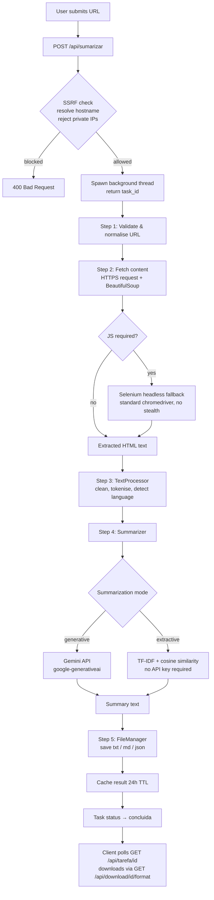
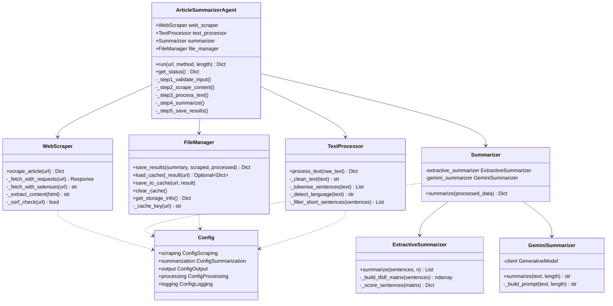
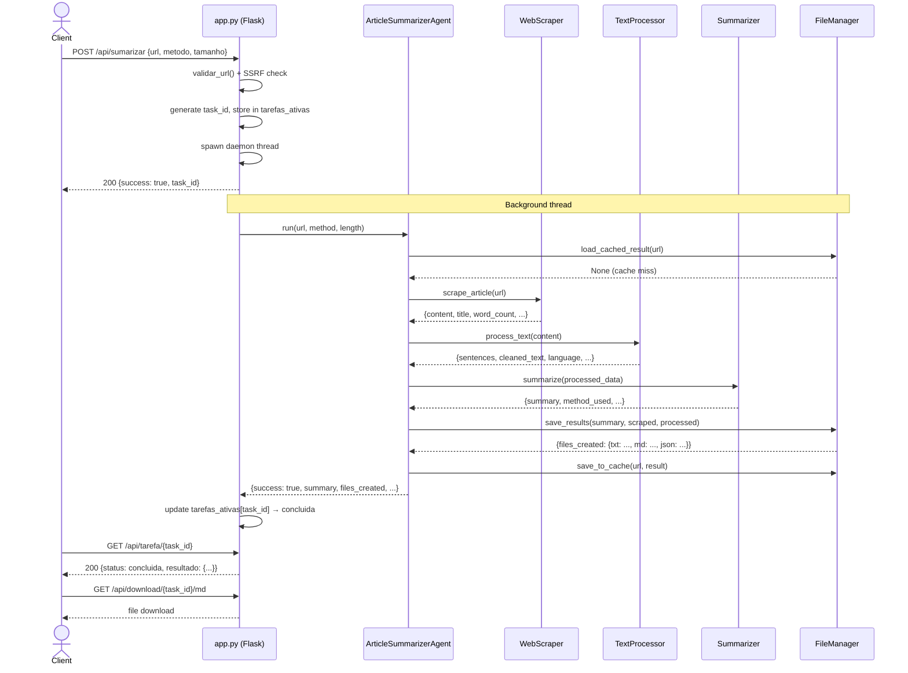

# Architecture: Article Summarizer Agent

## Overview

The Article Summarizer Agent is a Flask web application that accepts a URL, extracts the article text, processes it, and produces a summary. The pipeline runs asynchronously in a background thread so the HTTP request returns immediately with a task ID that the client polls for progress.

The application has two layers:

- **Web layer** (`app.py`): Handles HTTP, task lifecycle, threading, and file downloads.
- **Pipeline layer** (`main.py` + `modules/`): Executes the five-step extraction and summarization pipeline.

---

## High-Level Request Flow



---

## Component Diagram



---

## Flask API Sequence Diagram



---

## Module Responsibilities

| Module | File | Responsibility |
|---|---|---|
| Flask app | `app.py` | HTTP routing, task lifecycle, threading, CORS |
| Agent orchestrator | `main.py` | Five-step pipeline coordination, progress reporting |
| Config | `config.py` | Centralised settings, environment variable loading |
| Web scraper | `modules/web_scraper.py` | HTTP fetch, HTML parsing, content extraction, SSRF guard |
| Text processor | `modules/text_processor.py` | Text cleaning, tokenisation, language detection |
| Summarizer | `modules/summarizer.py` | Dispatches to Gemini or extractive; fallback logic |
| Extractive summarizer | `modules/summarizer.py` (inner class) | TF-IDF scoring, cosine similarity, sentence selection |
| Gemini summarizer | `modules/gemini_summarizer.py` (post-refactor) | Google Gemini API integration |
| File manager | `modules/file_manager.py` | Output file writing, cache read/write, storage info |

---

## Key Design Decisions

### 1. Two Summarization Modes

The application supports two modes selectable per-request:

- **Gemini (generative):** Calls Google Gemini API. Fast, high quality, natural language output. Requires `GEMINI_API_KEY`. Not usable offline.
- **Extractive TF-IDF (offline):** Scores sentences by TF-IDF weight and cosine similarity to the document centroid. Selects the top N sentences. No API key. No model download. Always available as fallback.

The `Summarizer` class dispatches based on the requested method. If `method=generative` is requested but the Gemini client fails (missing key, quota exceeded), it falls back to extractive automatically when `config.summarization.use_fallback=True`.

### 2. SSRF Protection Before Any HTTP Request

All URL inputs must pass an SSRF check before the scraper issues any network request. The check resolves the hostname to an IP address at the application layer and rejects private, loopback, and link-local ranges. This check runs in `app.py` before the background thread is spawned, so blocked requests never reach the scraper.

### 3. Async Task Processing via Threading

Each summarization request spawns a `daemon=True` Python thread. The Flask endpoint returns immediately with a `task_id`. The client polls `GET /api/tarefa/<task_id>` for status updates. Progress is stored in an in-memory dictionary protected by a `threading.Lock`.

**Production note:** Python threads are limited by the GIL for CPU-bound work and do not survive process restarts. For production workloads, replace the threading model with Celery workers and a Redis broker. Task state should be persisted to a database rather than in-memory dicts.

### 4. File-Based Cache

Computed summaries are cached as JSON files in `.cache/` with a SHA-256 hash of the URL as the filename. On cache hit, the full pipeline is skipped. TTL is 24 hours (checked by comparing file modification time).

**Production note:** File-based cache does not work across multiple instances. Replace with Redis for multi-instance deployments. The `FileManager` interface is designed to allow this substitution without changing the pipeline.

### 5. Selenium as Legitimate JS-Rendering Fallback

Some articles require JavaScript execution to render content (single-page apps, lazy-loaded bodies). When plain HTTP extraction yields insufficient content (< 100 characters), the scraper optionally falls back to a headless Selenium instance.

This Selenium usage is legitimate JS rendering only. It uses standard `chromedriver` with no stealth arguments, no fingerprint spoofing, and no human-behaviour simulation. WAF bypass via Selenium is explicitly prohibited — see `SECURITY.md`.

---

## Directory Structure

```
article_summarizer_agent/
├── app.py                  # Flask web application
├── main.py                 # Pipeline orchestrator (ArticleSummarizerAgent)
├── config.py               # Centralised configuration singleton
├── requirements.txt        # Python dependencies
├── Procfile                # Render/Heroku process declaration
├── runtime.txt             # Python version pin
├── SECURITY.md             # Security policy and threat model
├── modules/
│   ├── __init__.py
│   ├── web_scraper.py      # HTTP content extraction
│   ├── text_processor.py   # Text cleaning and tokenisation
│   ├── summarizer.py       # Extractive + Gemini summarizer
│   ├── gemini_summarizer.py# (post-refactor) Gemini API client
│   └── file_manager.py     # Output files and cache
├── templates/              # Jinja2 HTML templates
├── static/                 # CSS, JS, images
├── outputs/                # Generated summary files (gitignored)
├── .cache/                 # File-based result cache (gitignored)
├── docs/
│   ├── ARCHITECTURE.md     # This document
│   ├── AUDIT_REPORT.md     # Security and code audit findings
│   └── DEPLOYMENT.md       # Deployment guide
└── tests/                  # Unit and integration tests
```
